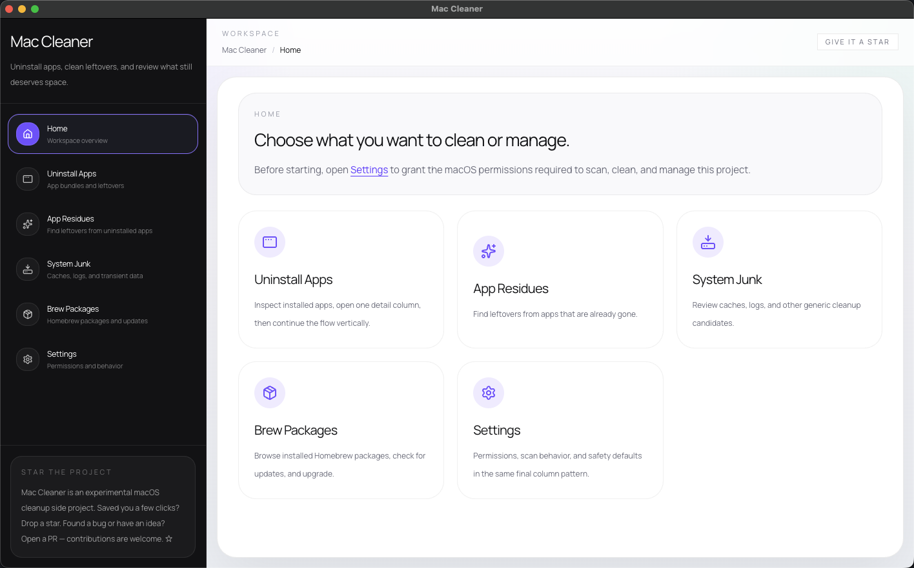
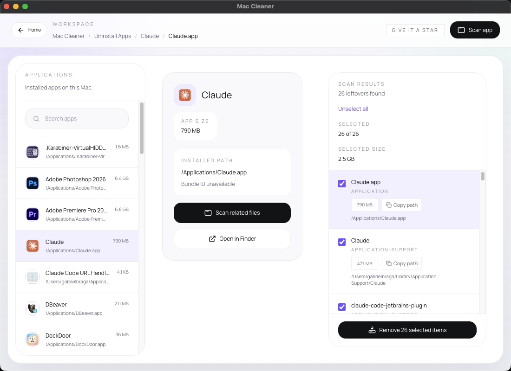

<div align="center">

# Mac Cleaner

**Finds the digital junk your apps left behind — and lets you actually do something about it.**

[](https://github.com/bragabriel/mac-cleaner/actions/workflows/ci.yml)
[](https://github.com/bragabriel/mac-cleaner/releases/latest)
[](LICENSE)
[-lightgrey)](https://github.com/bragabriel/mac-cleaner/releases/latest)



</div>

---

You install an app, use it for two weeks, then forget it exists. Months later you find its icon in Launchpad and its config files silently hoarding disk space across seven Library folders. Mac Cleaner finds all of it.

Built as an AI-assisted development experiment. Turns out I needed a Mac cleaner more than I needed sleep.

## Install

Download the latest `.dmg` from the [Releases page](https://github.com/bragabriel/mac-cleaner/releases/latest), open it, and drag **Mac Cleaner** into Applications.

> **The app is not code-signed or notarized** (that needs a paid Apple Developer account), so macOS will refuse to open it on first launch. To get past Gatekeeper:
>
> ```bash
> xattr -dr com.apple.quarantine "/Applications/Mac Cleaner.app"
> ```
>
> Only do that for software you trust. If you'd rather not, [build it from source](#running-from-source) instead — same app, your own machine.

Builds are **Apple Silicon (arm64) only** for now. On Intel Macs, run from source.

## What it does

### Uninstall Apps

Browse installed applications, open one, and see everything it owns before deciding to remove it — the bundle plus every file it scattered around your system. Pick what goes and what stays, then remove the lot in one pass.



### App Residue Scanner

Scan any installed app and see every file it left behind:

- **Application Support** — config files, databases, state
- **Preferences** — `.plist` files haunting your system
- **Caches** — gigabytes of stuff you forgot existed
- **Containers & Group Containers** — sandboxed app leftovers
- **Logs** — debug output from that one time you ran the app once
- **Saved Application State** — window positions for windows that no longer exist

Each file gets a confidence score (high/medium/low) so you know what's definitely safe to nuke and what might need a second look.

### Orphaned Residue Cleanup

Even after you delete an app, its files stick around like a bad houseguest. This mode scans your Library directories for leftovers from apps that are no longer installed — so you can clean up what uninstalling forgot.

### System Junk Cleanup

Cache folders. Log directories. Saved state from apps you opened once in 2019. This mode lists everything in your system junk directories so you can pick and choose what to delete.

### Homebrew Package Management

List installed formulae, see which ones are outdated (current vs. latest version), and upgrade individual packages without leaving the app.

### Settings

Grant the macOS permissions the scanners need, and set scan behavior and safety defaults.

## Safety

This app deletes things off your machine, so the rules are strict on purpose:

- **Trash, not `rm`.** Every removal goes to the Trash, so you can put it back.
- **Whitelisted paths only.** Removal is allowed from `/Applications`, `~/Applications`, and Library subdirectories. Nothing else is touchable.
- **Nothing happens without confirmation.** Every deletion requires an explicit yes.

## Running from source

You need Node.js 20+ and npm. That's it.

```bash
git clone https://github.com/bragabriel/mac-cleaner.git
cd mac-cleaner
npm install

# The real desktop app (Electron + filesystem access)
npm run dev:desktop

# Just the frontend in a browser (mock data, no system access)
npm run dev
```

Use **`dev:desktop`** for the actual experience — app scanning, residue detection, real file operations.
Use **`dev`** if you just want to tinker with the UI. It uses mock data and won't touch your system.

### Other commands

| Command | What it does |
|---|---|
| `npm run start:desktop` | Launch Electron without the dev server |
| `npm run dist:mac` | Build a `.dmg` into `release/` |
| `npm run lint` | Type-check the codebase |
| `npm run test` | Run unit tests |
| `npm run test:smoke` | End-to-end test against the real filesystem |

## Tech stack

React 19 · TypeScript · Vite 6 · Electron 37 · Tailwind CSS v4 · Vitest

## Contributing

Got an idea? Found a bug? Just want to prove you can write better code than an AI? Pull requests are open — see [CONTRIBUTING.md](CONTRIBUTING.md).

Be creative, have fun, and don't break anything important.

## License

[MIT](LICENSE) © Gabriel Braga

---

<div align="center">

**If this saved you from manually digging through `~/Library`, drop a ⭐ — it tells me someone actually uses this thing.**

</div>
